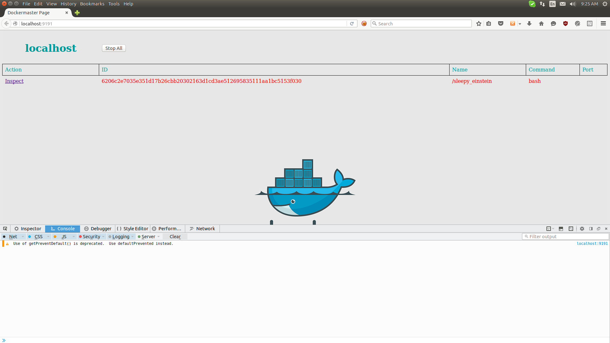
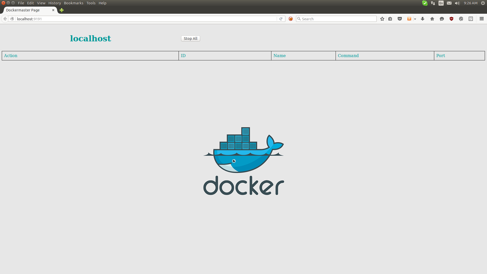

Dockmaster
==========

Dockmaster who oversees the workings of containers throughout a network.

Dockmaster is a overseer for all the containers running on all the servers. It's service discovery for containers.

The architecture of Dockmaster is simple.

Server
------

Will sit on a central server which is reachable by all the nodes on which an Agent is operating.

Agent
-----

An Agent sits on a node where there are docker containers running. The Agent reports to the Server about statuses of the containers next-to it.


Currently the Agent only reports about running containers. Other containers are not regarded because it would create a very convoluted view.

The frontend first needs to handle proper showing of the data that it gets.

Install
=======

Install All dependencies

```bash
    go get -v ./...
```

Starting the server:

```bash
    cd server
    go build # To build the project
    ./server
```

Starting the agent:

```bash
    cd agent
    go build # To build the project
    ./agent # running it without flags will make it run with default values. For flags, please see the Agent's README.
```

Starting the frontend:

```bash
    cd frontend
    go build # To build the project
    ./frontend # The front-end is very basic. Defining a server is not optional. Currently it has to run where the server is running.
```

Current Look
------------

The current look is a very simple table view:


After clicking inspect, a popup windows will provide more information about the container.


Bulk Stop
---------

Once you have an agent up and running, it is now possible to stop all running containers for that agent by clicking the 'Stop All' button next to the Agent.



The agent takes a minute to update its status, so the stopped container state, right now, will not be refreshed immediately. A message is received if the operation was successful or not. This, right now, is only displayed in the console output.


After the agent has refreshed its status, it can be seen that all the containers have been shutdown.


